# AI Agent Reference: OSS Automation System Architecture

- Status: canonical reference for agent work
- Verified against: production repository `origin/main` at `7893f45`
- Production repository: `oss_requests-cict`
- Runtime note: notification code does not use the retired `C:\OSS` workspace or any `.env` file. `run-bld.py` still has a separate build-time `.env` migration planned.

## 1. Purpose

The system receives an OSS request associated with a Jira issue, obtains either a YAML manifest attachment or free-form Jira description text, generates or validates a Black Duck scan manifest, checks out the requested source code, runs Black Duck Detect, and finalizes the Jira issue.

The production implementation is a Jenkins Pipeline from SCM. The canonical code is under `jenkins_scripts/` in the GitHub repository.

## 2. Production Source Of Truth

Use these paths from the GitHub repository:

- `jenkins_scripts/Jenkinsfile`: Jenkins orchestration
- `jenkins_scripts/pipeline_runner.py`: CLI entrypoint
- `jenkins_scripts/input_collector.py`: Jira input collection
- `jenkins_scripts/manifest_flow.py`: AI manifest generation and validation
- `jenkins_scripts/manifest_builder_llm.py`: LLM request, parsing, normalization, and catalog mapping
- `jenkins_scripts/prompts/manifest_system_prompt.md`: external system prompt
- `jenkins_scripts/manifest_validator.py`: manifest quality gate
- `jenkins_scripts/blackduck_catalog.py`: project and version lookup
- `jenkins_scripts/blackduck_catalog.yaml`: catalog data
- `jenkins_scripts/build_flow.py`: processing-label guard and OSS runner invocation
- `jenkins_scripts/run-bld.py`: source checkout, staging, and Black Duck scan
- `jenkins_scripts/finalize_flow.py`: Jira finalization and notification
- `jenkins_scripts/step7_mail.ps1` and `jenkins_scripts/SendMail/main.html`: notification assets

Do not use the root `C:\OSS\Jenkinsfile`, `C:\OSS\final`, or root `run-bld.py` as production source. They belong to the legacy/reference workspace.

## 3. End-To-End Flow

```mermaid
flowchart LR
    A[Jira issue] --> B[Jira Automation]
    B --> C[requests/pending/*.json on main]
    C --> D[GitHub Actions]
    D --> E[Jenkins buildWithParameters]
    E --> F[SCM checkout of production repo]
    F --> G[collect-input]
    G --> H{Input mode}
    H -->|YAML attachment| I[Use attached manifest]
    H -->|Description text| J[LLM manifest builder]
    J --> K[Normalize and filter]
    K --> L[Catalog mapping]
    I --> M[Strict validation]
    L --> M
    M --> N[run-build]
    N --> O[TeamForge checkout and staging]
    O --> P[Black Duck Detect]
    P --> Q[Finalize Jira]
```



### 3.1 GitHub Actions trigger

`.github/workflows/jenkins-oss-build.yml` runs when pending request JSON files change on `main`, and can also be manually dispatched. It:

1. Detects changed files under `requests/pending/`.
2. Deduplicates files by Jira key.
3. Calls Jenkins once per Jira key.
4. Sends `REQUEST_JSON` and the source commit SHA as `REQUEST_REF`.

### 3.2 Jenkins stages

`jenkins_scripts/Jenkinsfile` runs on a Windows agent and performs:

1. Clean workspace and SCM checkout.
2. Optional detached checkout of `REQUEST_REF`.
3. Precheck for scripts, catalog, and external prompt.
4. Runtime directory creation.
5. Jira input collection.
6. Input-mode detection.
7. AI manifest generation only when no YAML attachment is available.
8. OSS build and Black Duck scan.
9. Jira finalization.
10. Artifact archive and failure cleanup.

### 3.3 Python command boundaries

`pipeline_runner.py` exposes these subcommands:

- `collect-input`: reads the request JSON, queries Jira, and writes runtime contract files.
- `generate-manifest`: invokes the LLM builder and strict validator.
- `run-build`: applies the Jira processing-label guard and invokes `run-bld.py`.
- `finalize`: updates Jira labels/status and optionally sends mail.

The smaller flow modules own the behavior; `pipeline_runner.py` is the CLI router.

## 4. Input And Artifact Contract

### 4.1 Request input

- Request JSON: `requests/pending/<jira-key>_<timestamp>.json`
- `REQUEST_JSON`: repository-relative path only
- `REQUEST_REF`: 40-character commit SHA
- Jira query requires the configured project/status/labels and excludes `processing`, `processed`, and `oss-failed`

### 4.2 Runtime artifacts

The Jenkins workspace uses `jenkins_runtime/`:

- `jira_key.txt`
- `jira_summary.txt`
- `jira_request_text.txt` when the Jira issue has no YAML attachment
- `manifest_id.txt`, `manifest_url.txt`, `manifest_filename.txt` for an attachment path
- `scan-manifest.yaml` for an AI-generated manifest
- `manifest_path.txt`
- `last_run_summary.json`
- `detect_<unit>.log` and unit-specific `blackduck_bom_url`/`blackduck_ui_url` fields in `last_run_summary.json`
- build logs and failure cleanup artifacts

These artifacts are operational outputs, not source configuration.

## 5. Manifest Contract

```yaml
request:
  oem: RENAULT
  project_name: Renault Gen3
  sw_version: "source release metadata"
scan_units:
  - name: APPL
    checkout_commands: []
    scan_paths: []
    blackduck_project: Renault Gen3
    blackduck_version: SW V6.3.0_APPL
```

Current production validation treats `APPL` and `FBL` as the supported unit names. Each unit contains:

- ordered checkout commands
- relative filesystem scan paths
- canonical Black Duck project name
- Black Duck version in strict `SW V<version>_APPL|FBL` form

The LLM is only an initial extractor. Deterministic normalization removes URLs, headings, malformed links, and ignore candidates; catalog mapping canonicalizes project and OEM values; the validator is the final quality gate.

## 6. Catalog And OEM Model

`blackduck_catalog.yaml` is configuration data, not algorithm code. Each entry may define:

- canonical OEM
- canonical project
- aliases
- optional `version_by_unit`

Current catalog data contains Renault, GM, MB, and SKODA project entries, but onboarding another project still requires valid aliases, unit versions, repository commands, scan paths, credentials, and a regression fixture.

The runtime cache is external to the Jenkins workspace:

```text
OSS_CACHE_ROOT/<OEM>/<UNIT>
```

Existing Git repositories are refreshed incrementally. WSL `repo` flows use a separate WSL cache.

## 7. Credentials And External Services

Jenkins credential parameters and environment bindings:

- `JIRA_TOKEN_CRED_ID` -> `JIRA_OSS_TOKEN` (Secret Text)
- `OPENAI_KEY_CRED_ID` -> `OPENAI_API_KEY` (Secret Text)
- `TEAMFORGE_CRED_ID` -> `TEAMFORGE_USER` and `TEAMFORGE_PASSWORD` (Username/Password)
- `GITHUB_CRED_ID` -> `GITHUB_TOKEN` (Secret Text; private `github.com` checkout)
- `BLACKDUCK_CRED_ID` -> `BLACKDUCK_TOKEN` (Secret Text)
- `BLACKDUCK_CRED` -> Black Duck 웹 대시보드 계정; OSS Detect API 인증에는 사용하지 않음
- `SMTP_CRED_ID` -> notification username/password variables
- `SMTP_CREDENTIALS` -> Jenkins Username/Password credential bound as `SMTP_CREDENTIALS_USR` and `SMTP_CREDENTIALS_PSW` only during notification
- `OSS_MAIL_TO` -> required comma-separated recipient list configured in the `test` folder's Folder Properties; Jenkinsfile uses `withFolderProperties()` to expose it to the Pipeline
- `GITHUB_APP_AUTH` -> Jenkins SCM checkout credential, configured in the job SCM section

GitHub Actions Jenkins credentials are separate from Jenkins SCM and TeamForge credentials.

Black Duck runtime values include:

- `BLACKDUCK_TOKEN`: required
- `BLACKDUCK_URL`: environment override; current default is the internal Black Duck URL
- `BLACKDUCK_DETECT_JAR`: optional path override; the runner has a Windows default

Secrets must be injected by Jenkins and must never be copied into YAML, source code, Markdown, or logs.

The notification script and `run-bld.py` must not read `C:\OSS` or `.env`. `run-bld.py` uses `GITHUB_TOKEN` for private `github.com` checkout, `TEAMFORGE_USER`/`TEAMFORGE_PASSWORD` for `teamforge.example.com`, and `BLACKDUCK_TOKEN` for Detect, all injected by Jenkins. The notification script must not read `SMTP_USER` or `SMTP_PASSWORD`. Its SMTP default is `smtp.example.com:25` with SSL disabled, and it uses the SMTP credential username as the sender.

## 8. Current Known Constraints

- The validator currently enforces `APPL` and `FBL`; other units require schema/validator work.
- The runner supports Windows Git and WSL `repo` flows, not every possible SCM provider.
- Missing scan paths are logged as skipped; a build can still succeed if other paths resolve. Required-path policy is a remaining quality improvement.
- TLS verification is currently disabled by default in several paths and Black Duck certificate trust is enabled. This is an operational risk to address.
- The production README contains some historical wording, including a stale reasoning-effort statement. The Jenkinsfile and tested runtime behavior are the source of truth.
- Notification mail requires `OSS_MAIL_TO` in the `test` folder and a valid email Username plus Password in `SMTP_CREDENTIALS`.
- Black Duck mail links come from unit-specific summary results, not cross-unit parsing of `oss_build.log`; use the browser-compatible API Components deep-link.
- Mail template runtime fields must remain placeholders; do not hardcode a historical Jira key, project, or Jira URL. Black Duck links use the browser-compatible API Components deep-link.
- Failure mail must use `Pipeline-FAIL` when Jenkins or `last_run_summary.json` reports failure, and must render Black Duck buttons only for successful units. All-failed runs render no Black Duck button or generic Dashboard fallback.
- Failed request cleanup adds `oss-failed` and removes `processing` plus `oss-request`; retry requires an explicit operator label update after the cause is corrected.

## 9. Legacy Separation Rule

The following local folders are not production source for the GitHub SCM pipeline:

- `C:\OSS\freestyle\...`
- `C:\OSS\pipeline\...`

`C:\OSS` and local `.env` files are retired from the production runtime. Do not add new references to them. Runtime secrets must come from Jenkins Credentials; nonsecret configuration must come from Jenkins parameters or Folder Properties.

`run-bld.py` askpass files contain the TeamForge password temporarily. Windows and WSL checkout paths must delete every generated askpass file on success, failure, and creation or permission exceptions.

The local `pipeline` folder is a reference/prototype layout. It is not the production checkout.

They may be useful historical references, but production changes must be made in the GitHub repository under `jenkins_scripts/` and validated through a PR.

## 10. Local Reference Workspace Layout

`C:\OSS` is not the production checkout. Its local material is organized as follows:

- `pipeline/`: local Python-first Pipeline reference files and test manifests
- `freestyle/`: legacy Freestyle/Jenkins scripts and historical runners
- `DB/` and `JIra-Git_Allow_IP/`: supporting utilities retained outside the two pipeline groups

The local `pipeline/` files are reference material only. The real production source remains the GitHub repository paths listed above.
