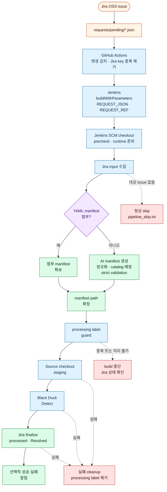
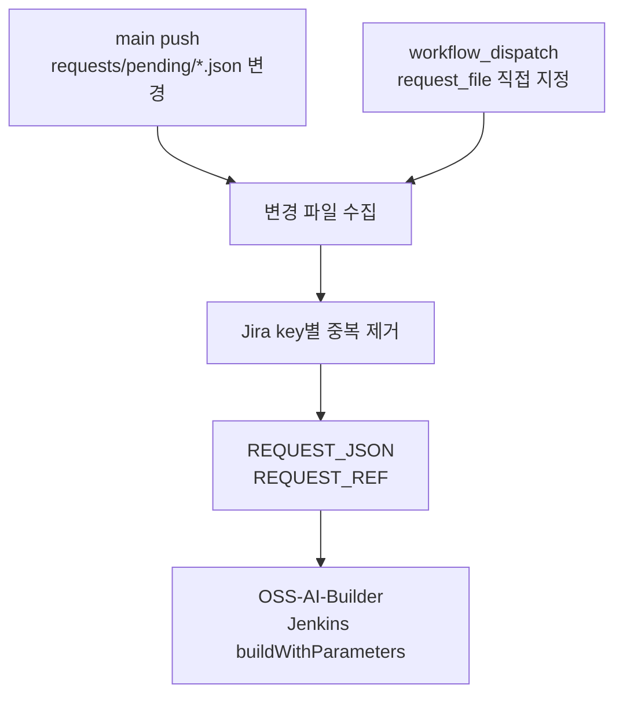
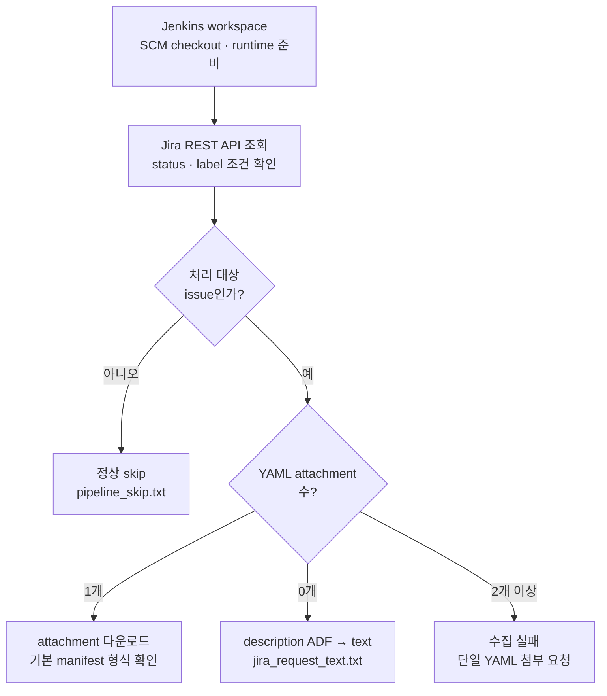
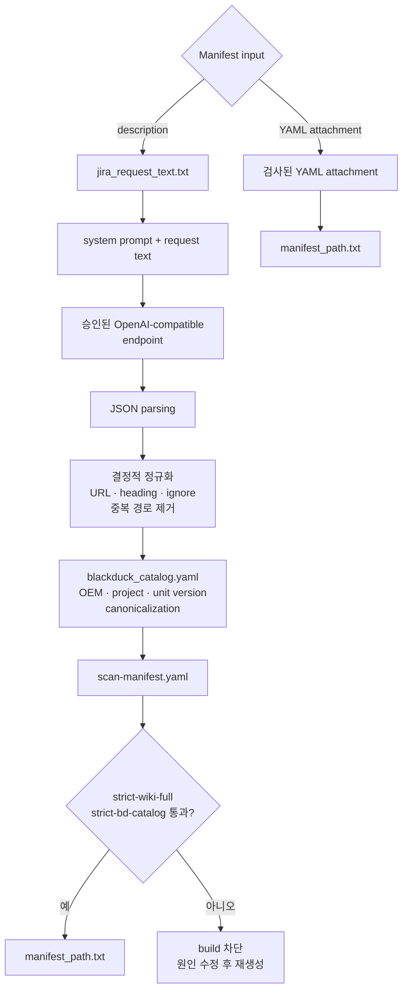
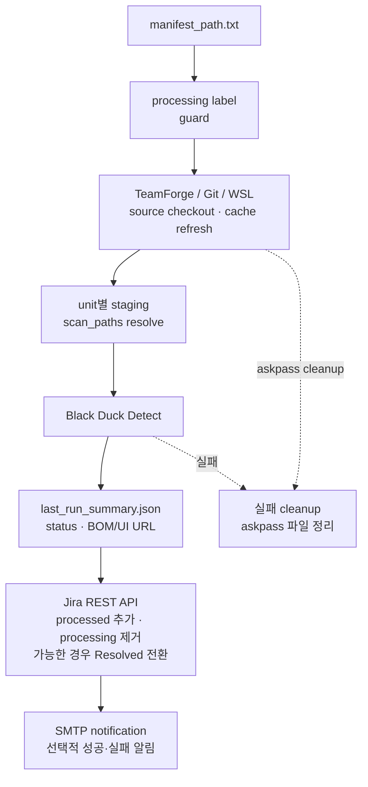

# OSS-AI-Builder
Black Duck 기반 OSS 자동화 검증과 AI Builder 기반 검증 명세서 자동 생성

# OSS Requests CI/CT 운영 가이드

> Jira OSS 요청을 GitHub, Jenkins, AI Builder, TeamForge, Black Duck으로 연결하는 사내 운영 파이프라인의 기준 문서입니다.

| 항목 | 기준 |
| --- | --- |
| 운영 범위 | `requests/pending/*.json` 기반 OSS manifest 생성, source checkout, Black Duck Detect, Jira 완료 처리 |
| 실행 모델 | GitHub Actions가 Jenkins `OSS-AI-Builder`를 호출하고 Jenkins가 실제 처리를 수행 |
| 운영 소스 | `jenkins_scripts/`와 `.github/workflows/`의 코드가 실행 동작의 최종 기준 |
| 문서 역할 | 운영자용 절차, 설정 계약, 보안 게이트, 장애 대응을 설명 |
| 지원 입력 | Jira YAML manifest 첨부 또는 Jira `description` 기반 AI manifest 생성 |

> [!WARNING]
> 현재 구현에는 운영 전 별도 승인이 필요한 항목이 있습니다. AI Builder는 기본적으로 `https://api.openai.com/v1`을 사용하고 TLS 검증을 끄는 경로가 존재하며, `run-bld.py`와 GitHub Actions도 SSL 우회 설정을 포함합니다. 또한 YAML 첨부 경로는 AI 경로의 `strict-bd-catalog` 검증을 거치지 않습니다. 기밀 Jira 데이터를 처리하거나 대외 운영으로 전환하기 전에 아래 [보안 및 운영 승인 게이트](#8-보안-및-운영-승인-게이트)를 충족해야 합니다.

## 1. 시스템 개요

### 1.1 목적

- Jira OSS 요청과 처리 이력을 Git으로 추적합니다.
- 요청 파일이 `main`에 반영되면 GitHub Actions가 Jira key 단위로 Jenkins 빌드를 호출합니다.
- YAML manifest가 있으면 해당 파일을 사용하고, 없으면 AI Builder가 Jira description에서 manifest를 생성합니다.
- 생성 또는 수집한 manifest로 source checkout과 Black Duck Detect를 수행합니다.
- 성공 시 Jira에 `processed`를 기록하고, 실패 시 `oss-failed`를 추가하면서 `processing`과 `oss-request`를 제거합니다.

### 1.2 운영 원칙

1. `main`에 직접 push하지 않고 feature/fix 브랜치와 Pull Request를 사용합니다.
2. credential 값, API key, 비밀번호, askpass 파일을 저장소·manifest·로그에 기록하지 않습니다.
3. LLM 결과를 그대로 실행하지 않고 정규화, catalog 매핑, validator를 통과시킵니다.
4. manifest의 `checkout_commands`는 실행 가능한 명령이므로 변경 리뷰 대상입니다.
5. 구현과 README가 달라지면 실행 코드와 테스트를 최종 기준으로 삼고 같은 PR에서 문서를 갱신합니다.

### 1.3 운영 소스 맵

| 영역 | 구현 위치 | 책임 |
| --- | --- | --- |
| GitHub trigger | `.github/workflows/jenkins-oss-build.yml` | 변경 감지, Jira key dedup, Jenkins 호출 |
| Jenkins orchestration | `jenkins_scripts/Jenkinsfile` | workspace, credential, stage, post 처리 |
| CLI routing | `jenkins_scripts/pipeline_runner.py` | `collect-input`, `generate-manifest`, `run-build`, `finalize` 라우팅 |
| Jira input | `jenkins_scripts/input_collector.py` | Jira 조회, ADF text 변환, YAML 첨부 수집 |
| AI manifest | `jenkins_scripts/manifest_builder_llm.py` | LLM 호출, JSON parsing, 정규화, catalog 매핑 |
| quality gate | `jenkins_scripts/manifest_validator.py` | manifest schema와 strict 규칙 검증 |
| build | `jenkins_scripts/run-bld.py` | TeamForge checkout, staging, Black Duck Detect |
| finalization | `jenkins_scripts/finalize_flow.py` | Jira label/status, notification |

## 2. 전체 처리 흐름

GitHub에서 문서를 처음 읽는 사람은 아래 개요를 위에서 아래로 따라가면 됩니다. 정상 경로는 실선, 외부 시스템 연동과 실패 처리는 점선으로 표시했습니다.

### 2.1 한눈에 보는 실행 순서



### 2.2 1단계: 요청 감지와 Jenkins 진입

GitHub Actions는 요청 파일을 감지하고 Jira key 단위로 중복을 제거한 뒤, 해당 revision을 Jenkins에 넘깁니다.



### 2.3 2단계: Jira 입력 수집과 경로 결정

Jenkins는 먼저 Jira 대상 여부를 확인합니다. 대상이 아니면 `pipeline_skip.txt`를 남기고 종료하며, 대상이면 YAML 첨부 유무에 따라 두 경로 중 하나를 선택합니다.



### 2.4 3단계: Manifest 확보와 품질 게이트

두 입력 경로 모두 최종적으로 `manifest_path.txt`를 만들지만, 현재 strict validator를 통과하는 경로는 AI Builder 경로입니다. 첨부 YAML의 검증 수준과 운영 제한은 [입력 모드 정책](#41-입력-모드)에 따릅니다.



### 2.5 4단계: Build, Scan, Jira 완료 처리

Manifest가 확정되면 첨부 경로와 AI 경로는 같은 build pipeline을 공유합니다. source checkout과 Black Duck 결과는 unit별 로그 및 `last_run_summary.json`으로 남습니다.



### 2.6 GitHub Actions trigger

`.github/workflows/jenkins-oss-build.yml`은 다음 조건으로 동작합니다.

- `main` push에서 `requests/pending/*.json`이 변경된 경우
- `workflow_dispatch`에서 `request_file`을 직접 지정한 경우
- 동일한 push에 같은 Jira key를 가진 파일이 여러 개 있으면 Jira key별로 한 번만 Jenkins를 호출
- Jenkins에는 요청 파일 경로인 `REQUEST_JSON`과 40자리 commit SHA인 `REQUEST_REF`를 전달
- GitHub Actions secret인 `JENKINS_DEVOPS_USER`, `JENKINS_DEVOPS_API_TOKEN`, `JENKINS_JOB_AUTH_TOKEN`은 Jenkins 원격 호출 전용

### 2.7 Jira 대상 조건

`REQUEST_JSON`의 `jira_key`를 기준으로 다음 조건을 만족하는 Jira issue를 조회합니다.

- status: `In Progress`
- label: `oss-request` 포함
- label: `processed`, `processing`, `oss-failed` 미포함

대상 issue가 없으면 `pipeline_skip.txt`를 남기고 실제 build를 수행하지 않습니다. 이는 중복 실행을 막기 위한 정상적인 skip일 수 있으므로, 재실행 전 Jira status와 label을 확인해야 합니다.

## 3. 운영 실행 절차

### 3.1 자동 실행

1. feature/fix 브랜치를 생성합니다.
2. `requests/pending/<JIRA-KEY>_<timestamp>.json`을 추가하거나 수정합니다.
3. `jira_key`와 요청 파일 경로가 일치하는지 확인합니다.
4. 변경을 commit하고 Pull Request를 생성합니다.
5. 리뷰와 필수 검증을 통과한 뒤 `main`에 merge합니다.
6. GitHub Actions run, Jenkins `OSS-AI-Builder` build, Jira label/status를 순서대로 확인합니다.

`main`에 직접 push하는 방식은 이 저장소의 변경 관리 정책에 맞지 않습니다.

### 3.2 수동 실행

GitHub Actions의 `workflow_dispatch`를 사용할 때 `request_file`에 저장소 상대 경로를 입력합니다.

```text
requests/pending/OSS-40_20260710_071010406.json
```

입력 경로는 반드시 `requests/pending/<file>.json` 형식이어야 하며, 존재하지 않는 파일이나 `..` 경로는 허용하지 않습니다. 수동 Jenkins 재실행은 Jira의 `processing` 또는 `processed` 상태를 먼저 확인하고 서비스 오너 승인을 받은 뒤 수행합니다.

### 3.3 운영자 완료 확인

- GitHub Actions: changed request file 감지와 Jenkins 호출 성공
- Jenkins: `Generate Manifest With AI`, `Run OSS Build`, `Finalize Jira` stage 결과
- Jira: 성공 시 `processed` 추가, `processing` 제거, 가능한 경우 `Resolved` 전환; 실패 시 `oss-failed` 추가와 `oss-request` 제거
- Black Duck: unit별 BOM/UI URL과 scan status
- 알림: `RUN_NOTIFY` 및 `RUN_NOTIFY_ON_FAILURE` 동작과 수신자; 실패 메일은 `Pipeline-FAIL`이며 성공 unit만 Black Duck 버튼 제공

## 4. 입력과 AI Builder 정책

### 4.1 입력 모드

| 입력 | 현재 동작 | AI 실행 | 검증 수준 |
| --- | --- | --- | --- |
| YAML attachment 1개 | Jira attachment 다운로드 후 `manifest_path.txt` 기록 | 생략 | 파일이 비어 있지 않고 manifest 형태인지 기본 확인 |
| YAML attachment 없음 | Jira `description` ADF를 text로 변환해 `jira_request_text.txt` 기록 | 실행 | 정규화, catalog 매핑, `strict-wiki-full`, `strict-bd-catalog` |
| YAML attachment 여러 개 | 수집 단계에서 실패 | 실행하지 않음 | 운영자에게 단일 YAML 첨부 요청 |
| YAML도 description도 없음 | 수집 단계에서 실패 | 실행하지 않음 | Jira 요청 보완 필요 |

YAML 첨부 경로에서 `manifest_path.txt`를 기록한다는 것은 **전체 파이프라인을 생략한다는 뜻이 아니라 AI manifest 생성만 생략한다는 뜻**입니다. 이후 processing label, source checkout, staging, Black Duck Detect, Jira finalize는 동일하게 실행됩니다.

현재 첨부 YAML은 [input_collector.py](jenkins_scripts/input_collector.py)의 기본 형식 검사만 거칩니다. AI 경로와 같은 strict catalog 검증이나 checkout command allowlist가 적용되지 않으므로, 승인된 작성자와 template에 한정하고 strict validation 보완 전까지 운영 위험으로 관리해야 합니다.

### 4.2 AI Builder 처리 순서

1. `jira_request_text.txt`의 description text를 읽습니다.
2. `manifest_system_prompt.md`를 system prompt로 로드합니다.
3. Jenkins credential에서 `OPENAI_API_KEY`를 주입하고 OpenAI-compatible API를 호출합니다.
4. LLM 응답의 JSON object를 parsing합니다.
5. 결정적 정규화로 URL, heading, ignore 후보, 중복 경로와 잘못된 command를 제거하고 path 구조를 복원합니다.
6. `blackduck_catalog.yaml` 기준으로 OEM, project, unit version을 canonical 값으로 매핑합니다.
7. `scan-manifest.yaml`을 생성합니다.
8. `strict-wiki-full`과 `strict-bd-catalog` 검증을 통과한 경우에만 build 단계로 넘깁니다.

LLM은 초기 추출기일 뿐이며, 실행 가능한 manifest를 승인하는 주체가 아닙니다. 최종 승인 기준은 deterministic post-processing과 validator입니다.

### 4.3 AI 데이터 처리 원칙

- 현재 AI 입력에는 Jira `description`만 포함되며 Jira 댓글은 조회하거나 전달하지 않습니다.
- description에는 개인정보, credential, 비밀번호, API key, 기밀 소스 전문을 입력하지 않습니다.
- 외부 AI endpoint 사용 전 정보보호·법무·서비스 오너의 데이터 처리 승인을 확인합니다.
- 기본 Jenkins parameter가 public endpoint를 가리킬 수 있으므로, 운영 환경에서는 조직이 승인한 내부 또는 계약된 endpoint만 allowlist로 허용합니다.
- AI 요청 원문과 생성 manifest는 Jenkins artifact 접근 권한 및 보존 정책의 적용 대상입니다.
- 모델 제공자의 학습 사용 여부, 보존 기간, 국외 이전 여부는 계약과 보안 정책으로 별도 확인합니다.

댓글 반영이 필요한 경우에는 description과 댓글의 우선순위, 작성자·시각 보존, 최신 변경 지시 정책, 원문 artifact 보관, Jenkins on/off parameter를 먼저 설계한 뒤 구현해야 합니다. 현재 기능으로 간주하지 않습니다.

## 5. Manifest 계약

### 5.1 표준 구조

```yaml
request:
  oem: RENAULT
  project_name: Renault Gen3
  sw_version: "source release metadata"
scan_units:
  - name: APPL
	checkout_commands: []
	scan_paths: []
	blackduck_project: Renault Gen3
	blackduck_version: SW V6.3.0_APPL
```

필수 규칙은 다음과 같습니다.

- root에 `request`와 `scan_units`가 있어야 합니다.
- `request`에는 `oem`, `project_name`, `sw_version`이 필요합니다.
- 각 unit에는 `name`, `checkout_commands`, `scan_paths`, `blackduck_project`, `blackduck_version`이 필요합니다.
- 현재 strict validation이 지원하는 unit은 `APPL`, `FBL`입니다.
- `blackduck_version`은 `SW V<version>_APPL` 또는 `SW V<version>_FBL` 형식이어야 합니다.
- `scan_paths`는 source checkout 기준 상대 경로여야 하며 URL, heading, 설명 문장을 넣지 않습니다.
- `checkout_commands`는 실제 shell에서 실행되므로 복사·붙여넣기 가능한 안전한 명령만 허용합니다.

`sw_version`은 release metadata이고, Black Duck dashboard version key인 `blackduck_version`과 동일한 필드가 아닙니다.

### 5.2 산출물 계약

| 파일 | 생성 시점 | 의미 |
| --- | --- | --- |
| `jira_key.txt` | input 수집 | 대상 Jira key |
| `jira_summary.txt` | input 수집 | Jira issue summary |
| `jira_request_text.txt` | YAML 미첨부 시 | AI Builder 입력 text |
| `manifest_id.txt` | YAML 첨부 시 | Jira attachment id |
| `manifest_url.txt` | YAML 첨부 시 | attachment content URL |
| `manifest_filename.txt` | YAML 첨부 시 | 다운로드 파일명 |
| `manifest_path.txt` | manifest 확보 후 | build가 사용할 manifest 경로 |
| `scan-manifest.yaml` | AI 경로 | AI가 생성하고 검증한 manifest |
| `oss_build.log` | build | checkout·staging·Detect 통합 로그 |
| `detect_<unit>.log` | unit scan | unit별 Detect 로그 |
| `last_run_summary.json` | scan | 결과 status와 unit별 BOM/UI URL |
| `pipeline_skip.txt` | 대상 없음 | 실제 build를 수행하지 않은 사유 |

`jenkins_runtime/`은 실행 산출물 영역이고 source cache는 `OSS_CACHE_ROOT/<OEM>/<UNIT>`에 유지됩니다. Jenkins workspace 정리는 source cache를 삭제하지 않습니다.

## 6. Jenkins 및 외부 시스템 구성

### 6.1 Jenkins job 기본값

| 항목 | 값 또는 정책 |
| --- | --- |
| Job | `OSS-AI-Builder` |
| 정의 | `Pipeline script from SCM` |
| SCM branch | `main` |
| Pipeline script | `jenkins_scripts/Jenkinsfile` |
| Runtime | Windows Jenkins agent, Python 3.x, PyYAML |
| Build retention | Jenkinsfile 기준 최근 30 builds |
| Source cache | `OSS_CACHE_ROOT` 아래 유지 |
| Folder property | 알림 사용 시 `OSS_MAIL_TO` 필수 |

### 6.2 Jenkins parameters

| Parameter | 현재 기본값/형식 | 운영 주의 |
| --- | --- | --- |
| `REQUEST_JSON` | `requests/pending/<file>.json` | 저장소 상대 경로만 허용 |
| `REQUEST_REF` | 40자리 commit SHA | 요청 파일이 포함된 source revision |
| `OPENAI_MODEL` | `gpt-5.6-luna` | endpoint가 지원하는 모델인지 확인 |
| `OPENAI_BASE_URL` | `https://api.openai.com/v1` | 승인된 endpoint allowlist 필요 |
| `OPENAI_REASONING_EFFORT` | `xhigh`, `high`, `medium`, `low`, `none` | 현재 기본 선택값은 `xhigh`; `max`는 유효한 선택값이 아님 |
| `JIRA_EMAIL` | Jenkins에 설정된 API 계정 | 개인 계정보다 전용 service account 권장 |
| `PYTHON_CMD` | `python` | agent에서 실행 가능한 Python이어야 함 |
| `OSS_CACHE_ROOT` | agent의 절대 경로 | 충분한 디스크와 접근 권한 필요 |
| `GITHUB_CRED_ID` | `OSS_GITHUB` | private GitHub checkout용 Secret Text credential |
| `RUN_NOTIFY` | `false` | 성공 후 알림 실행 |
| `RUN_NOTIFY_ON_FAILURE` | `false` | 실패 post 처리 후 알림 실행 |

### 6.3 Credential binding

credential ID와 실제 secret 값은 문서나 source에 기록하지 않습니다.

| Jenkins parameter/credential | Pipeline binding | 용도 |
| --- | --- | --- |
| `JIRA_TOKEN_CRED_ID` | `JIRA_OSS_TOKEN` | Jira REST API |
| `OPENAI_KEY_CRED_ID` | `OPENAI_API_KEY` | AI Builder API |
| `TEAMFORGE_CRED_ID` | `TEAMFORGE_USER`, `TEAMFORGE_PASSWORD` | TeamForge checkout 및 askpass |
| `GITHUB_CRED_ID` | `GITHUB_TOKEN` | private `github.com` checkout 및 askpass |
| `BLACKDUCK_CRED_ID` | `BLACKDUCK_TOKEN` | Black Duck Detect API |
| `SMTP_CRED_ID` | `SMTP_CREDENTIALS_USR`, `SMTP_CREDENTIALS_PSW` | notification SMTP |
| `GITHUB_APP_AUTH` | Jenkins SCM 설정 | 비공개 GitHub repository checkout |

`OPEN_API_KEY`는 Jenkins credential ID이고 Python이 읽는 환경변수명은 `OPENAI_API_KEY`입니다. `GITHUB_CRED_ID`는 PAT를 저장한 Jenkins Secret Text credential이어야 하며, Python은 그 값을 `GITHUB_TOKEN`으로 읽습니다. `run-bld.py`는 checkout URL이 `github.com`이면 `GITHUB_TOKEN`, `teamforge.example.com`이면 `TEAMFORGE_USER`/`TEAMFORGE_PASSWORD`를 사용합니다. GitHub Actions의 Jenkins 호출용 secret과 Jenkins SCM credential, TeamForge credential, OSS GitHub checkout credential은 서로 대체되지 않습니다.

### 6.4 인프라 prerequisite

| 실행 위치 | 필수 조건 |
| --- | --- |
| GitHub Actions self-hosted `linux-controller` | `curl`, `jq`, Git, Jenkins HTTPS 접근, GitHub secret 권한 |
| Jenkins Windows agent | Python 3.x, PyYAML, Git, WSL/repo 사용 환경, Java 및 Black Duck Detect JAR |
| Jira | issue 조회·label 변경·transition 권한을 가진 service account |
| TeamForge | checkout repository 접근 권한과 credential |
| Black Duck | API token, URL, Detect JAR, project/version 권한 |
| SMTP | `smtp.example.com:25`, SSL 정책, 발신자 및 `OSS_MAIL_TO` 설정 |
| AI endpoint | 승인된 URL, 모델 권한, quota, CA trust chain, 네트워크 egress 승인 |

## 7. 관찰 가능성 및 장애 대응

### 7.1 확인 순서

1. GitHub Actions run의 변경 파일과 Jenkins HTTP 호출 결과를 확인합니다.
2. Jenkins Console에서 실패한 stage와 `REQUEST_JSON`, `REQUEST_REF`를 확인합니다.
3. `jenkins_runtime`의 contract file, `oss_build.log`, unit별 Detect log를 확인합니다.
4. Jira의 `processing`, `processed`, `oss-failed` label과 status를 확인합니다.
5. Black Duck URL은 공유 log를 추측하지 말고 `last_run_summary.json`의 unit별 값을 사용합니다.

### 7.2 장애 대응 표

| 증상 | 우선 확인 | 조치 |
| --- | --- | --- |
| `pipeline_skip.txt` 생성 | Jira status와 `processing`/`processed` label | 대상 issue가 실제 처리 대상인지 확인한 뒤 승인된 방식으로 재실행 |
| `REQUEST_JSON` 오류 | 경로, 파일 존재, `REQUEST_REF` SHA | PR merge revision과 request path를 교정 |
| Jira input 수집 실패 | Jira token, JQL 조건, description/attachment | issue label/status와 API 권한 확인 |
| AI 호출 실패 | endpoint, model, quota, `OPENAI_API_KEY`, `jira_request_text.txt` | 승인된 endpoint와 credential을 확인하고 원문을 로그에 복사하지 않음 |
| catalog/manifest validation 실패 | `scan-manifest.yaml`, catalog alias, unit/version 형식 | 원인을 수정한 뒤 재생성; validator 우회 금지 |
| TeamForge checkout 실패 | `oss_build.log`, TeamForge credential, Git/WSL 네트워크 | checkout command와 cache 상태를 확인하고 askpass 파일 잔존 여부 점검 |
| scan path 미발견 | unit log와 실제 checkout tree | 경로를 보완; 현재 구현은 일부 missing path가 있어도 다른 경로가 있으면 계속될 수 있음 |
| Black Duck Detect 실패 | `detect_<unit>.log`, `last_run_summary.json`, token/JAR/URL | unit별 원인을 해결한 뒤 Jira label 상태를 확인 |
| `processing` 또는 `oss-request`가 남음 | 실행 중인 Jenkins build 존재 여부와 failure cleanup 로그 | 활성 build가 없음을 확인한 뒤 `oss-failed` 추가, `processing`/`oss-request` 제거 결과를 검증 |
| 메일 실패 | `OSS_MAIL_TO`, SMTP credential, sender | scan 결과와 Jira finalize 결과를 먼저 확인하고 알림만 재시도 |

실패한 pipeline의 `post` 단계는 Jira에 `oss-failed`를 추가하고 `processing`과 `oss-request`를 제거합니다. 실패 메일은 `last_run_summary.json`의 전체 상태를 기준으로 `Pipeline-FAIL`을 표시하며, 실패 unit에는 Black Duck 버튼을 만들지 않습니다. cleanup 자체가 실패하면 Jira 상태를 수동으로 변경하기 전에 실제 실행 중인 build가 없는지 확인해야 합니다.

### 7.3 재실행 정책

- 같은 Jira key에 대한 중복 실행은 label guard에 의해 차단될 수 있습니다.
- 재실행 전 기존 build, Jira label/status, source revision, manifest revision을 기록합니다.
- `oss-failed` issue는 자동 재실행하지 않습니다. 원인을 수정한 뒤 운영자가 기존 build가 없음을 확인하고 `oss-failed`를 제거하고 `oss-request`를 다시 추가한 경우에만 명시적으로 재시도합니다.
- 이미 `processed`인 issue는 단순 재실행하지 말고 변경 요청 또는 운영자 승인 절차를 따릅니다.
- 재실행 결과는 기존 build와 구분되는 Jenkins build number와 Jira audit trail로 남겨야 합니다.

## 8. 보안 및 운영 승인 게이트

### 8.1 현재 구현과 운영 기준

| 통제 항목 | 현재 구현 | 공식 운영 기준 |
| --- | --- | --- |
| Secret 주입 | Jenkins `withCredentials` 사용 | secret을 CLI, YAML, 로그에 직접 넣지 않고 주기적으로 교체 |
| AI endpoint | parameter로 임의 URL 지정 가능 | 승인된 endpoint allowlist와 데이터 처리 계약 적용 |
| TLS | AI builder 기본 실행 경로가 `--insecure`; `run-bld.py`와 GHA에 SSL 우회 설정 존재 | production CA trust chain을 설치하고 TLS 검증을 기본 활성화 |
| Manifest command | `shell=True`로 checkout command 실행 | 신뢰된 작성자 제한, command allowlist, 위험 command 차단과 리뷰 적용 |
| YAML 첨부 | 기본 형식 검사 후 build 경로로 전달 | AI 경로와 동일한 schema/catalog/command 검증 적용 |
| Artifact | Jenkins runtime log와 request metadata archive | 접근 제어, 보존 기간, 민감정보 마스킹, 폐기 정책 적용 |
| Cache | `OSS_CACHE_ROOT`에 source checkout 유지 | 전용 경로 권한, 디스크 quota, 주기적 정리와 접근 감사 |
| Notification | SMTP credential과 folder property 사용 | 수신자 최소화, 메일 본문 민감정보 제한, SMTP 정책 준수 |

다음 조건을 만족하지 않으면 기밀 또는 개인정보가 포함된 Jira issue를 AI 경로로 처리하지 않습니다.

- AI endpoint와 조직의 데이터 처리 계약이 승인됨
- TLS 인증서 검증이 활성화되고 네트워크 egress가 승인됨
- artifact와 로그 접근 권한 및 보존 기간이 정의됨
- YAML 첨부 strict validation 또는 승인된 manifest 작성자 정책이 적용됨
- service account와 credential rotation 담당자가 지정됨

### 8.2 금지 사항

- API key, password, private key를 request JSON, YAML, prompt, README, log에 저장하지 않습니다.
- `C:\OSS` legacy workspace나 로컬 `.env`를 production runtime의 secret/config source로 사용하지 않습니다.
- 검증 실패를 무시하기 위해 `--skip-validate`를 운영 build에 사용하지 않습니다.
- Black Duck 또는 Jira credential 값을 command line, screenshot, mail 본문에 노출하지 않습니다.
- 승인되지 않은 public AI endpoint로 source code, 개인 정보, 고객 정보를 전송하지 않습니다.

## 9. 변경·테스트·배포 관리

### 9.1 변경 절차

1. 현재 `main`에서 feature/fix/docs branch를 생성합니다.
2. 변경 목적과 영향 범위를 한 가지 주제로 유지합니다.
3. 코드, prompt, catalog, workflow, README가 함께 바뀌면 동일 PR에서 계약을 갱신합니다.
4. 필수 테스트와 보안 검토 결과를 PR에 기록합니다.
5. 리뷰어가 승인한 뒤 `main`에 merge합니다.
6. merge 후 GitHub Actions, Jenkins, Jira, Black Duck 결과를 확인합니다.

직접 commit하거나 직접 merge하지 않으며, remote branch 자동 삭제 정책에 맞춰 merge 후 로컬 branch를 정리합니다.

### 9.2 기본 검증 명령

Windows Jenkins agent 또는 동일한 Python 환경에서 다음 순서로 실행합니다.

```powershell
python -m py_compile jenkins_scripts\manifest_builder_llm.py jenkins_scripts\pipeline_runner.py
python -m unittest discover -s tests -v
```

manifest 변경 시에는 YAML parsing, strict wiki/catalog validation, URL·Markdown link filtering, ignore path filtering, parent/child path reconstruction, missing path, catalog alias ambiguity를 확인합니다. checkout/build 변경 시에는 production credential 없이 dry-run 또는 mock command test를 사용합니다.

### 9.3 운영 변경 체크리스트

- [ ] request schema와 Jira key 조건을 확인했습니다.
- [ ] AI endpoint와 데이터 등급을 확인했습니다.
- [ ] credential ID와 binding을 변경하지 않았거나 migration을 문서화했습니다.
- [ ] manifest contract와 catalog version을 검증했습니다.
- [ ] checkout command가 안전하고 재현 가능한지 검토했습니다.
- [ ] TLS, artifact 보존, 로그 민감정보 노출을 점검했습니다.
- [ ] 실패 시 Jira `oss-failed` 처리와 `oss-request` 재추가 기반의 명시적 재실행 절차를 확인했습니다.
- [ ] README와 테스트가 실제 동작과 일치합니다.

## 10. 현재 제약과 개선 backlog

다음 항목은 현재 구현의 제약이며, 완료 전까지 README에서 제공 기능으로 간주하지 않습니다.

| 우선순위 | 항목 | 완료 기준 |
| --- | --- | --- |
| P0 | TLS 검증 기본 활성화 | AI, Git, Black Duck, Jenkins 호출에 CA 검증 적용 및 회귀 테스트 |
| P0 | YAML 첨부 strict validation | schema, catalog, command allowlist를 AI 경로와 동일하게 적용 |
| P1 | checkout command sandbox/allowlist | 위험 command 차단, 승인된 command set, audit log |
| P1 | AI data governance | endpoint allowlist, 정보 등급, 보존·삭제, 제공자 계약 문서화 |
| P1 | artifact 보존 정책 | Jenkins artifact 접근권한, retention, secret scanning, 삭제 검증 |
| P2 | required scan path 정책 | 필수 경로 누락 시 build 실패 여부를 명시하고 테스트 |
| P2 | Jira 댓글 반영 | 최신 변경 지시 우선순위와 opt-in parameter 구현 |
| P2 | 지원 unit 확장 | validator, runner, catalog, regression fixture를 함께 갱신 |

현재 validator가 지원하는 unit은 `APPL`과 `FBL`이며, runner는 Windows Git과 WSL `repo` 흐름 중심입니다. missing scan path가 있어도 다른 path가 해결되면 build가 성공할 수 있으므로, 필수 경로 정책이 필요한 프로젝트는 별도 검증을 추가해야 합니다.

## 11. 참고 파일

- [`.github/workflows/jenkins-oss-build.yml`](.github/workflows/jenkins-oss-build.yml): GitHub Actions trigger
- [`jenkins_scripts/Jenkinsfile`](jenkins_scripts/Jenkinsfile): Jenkins Pipeline
- [`jenkins_scripts/pipeline_runner.py`](jenkins_scripts/pipeline_runner.py): CLI entrypoint
- [`jenkins_scripts/input_collector.py`](jenkins_scripts/input_collector.py): Jira input contract
- [`jenkins_scripts/manifest_builder_llm.py`](jenkins_scripts/manifest_builder_llm.py): AI Builder
- [`jenkins_scripts/prompts/manifest_system_prompt.md`](jenkins_scripts/prompts/manifest_system_prompt.md): system prompt
- [`jenkins_scripts/manifest_validator.py`](jenkins_scripts/manifest_validator.py): manifest quality gate
- [`jenkins_scripts/blackduck_catalog.yaml`](jenkins_scripts/blackduck_catalog.yaml): catalog configuration
- [`jenkins_scripts/run-bld.py`](jenkins_scripts/run-bld.py): checkout, staging, Detect
- [`jenkins_scripts/finalize_flow.py`](jenkins_scripts/finalize_flow.py): Jira finalization and notification
- [`CONVENTIONS.md`](CONVENTIONS.md): 개발·GitHub·보안 convention
- [`AGENTS.md`](AGENTS.md): production architecture reference
