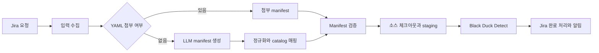

# OSS AI Builder

Jira로 접수된 OSS 분석 요청을 수집하고, 스캔 명세 생성부터 소스 체크아웃, Black Duck 분석, 결과 통보까지 자동화한 Jenkins 기반 파이프라인입니다.

> 이 저장소는 사내 프로젝트를 경력 포트폴리오용으로 비식별화한 버전입니다. 식별 가능한 실제 계정, 토큰 및 사내 주소는 포함하지 않습니다.

## 프로젝트 배경

OSS 분석 요청마다 담당자가 Jira 내용을 해석하고, 저장소와 분석 경로를 정리한 뒤 스캔 도구를 실행하는 반복 작업이 필요했습니다. 입력 형식이 일정하지 않아 누락이나 오입력 가능성이 있었고, 여러 시스템에 처리 상태가 분산되어 결과 추적도 어려웠습니다.

이 프로젝트는 해당 절차를 하나의 파이프라인으로 연결해 다음을 해결합니다.

- Jira 요청과 YAML 첨부파일 자동 수집
- 자연어 요청을 스캔 manifest로 변환
- LLM 출력에 대한 결정론적 검증과 정규화
- Git 및 WSL 기반 소스 체크아웃과 작업공간 재사용
- Black Duck Detect 실행과 결과 URL 수집
- Jira 상태 변경, 실패 복구 및 이메일 알림

## 처리 흐름



파이프라인은 `collect-input`, `generate-manifest`, `run-build`, `finalize` 네 단계로 분리했습니다. 각 단계는 파일 기반 runtime contract로 연결되어 개별 재현과 장애 분석이 가능합니다.

## 주요 구현 내용

### LLM을 보조 도구로 제한

LLM은 자연어에서 초기 manifest 후보를 추출하는 역할만 담당합니다. 생성 결과는 URL·Markdown·잘못된 경로를 제거하고, catalog의 프로젝트명과 버전으로 정규화한 뒤 strict validator를 통과해야 다음 단계로 이동합니다.

### 실행 경계 분리

Jenkinsfile은 credential binding과 stage orchestration만 담당하고, 실제 동작은 작은 Python flow 모듈로 분리했습니다. 이를 통해 Jira 연동, manifest 처리, 빌드, 완료 처리를 독립적으로 테스트할 수 있습니다.

### 안전한 credential 처리

API key와 비밀번호는 Jenkins Credentials에서 환경변수로 주입합니다. 저장소, manifest와 일반 로그에는 실제 secret을 기록하지 않으며, 체크아웃용 임시 askpass 파일은 성공과 실패 경로 모두에서 정리합니다.

### 실패 상태의 명시적 관리

중복 실행을 막기 위해 Jira processing label을 guard로 사용합니다. 실패 시 processing 상태를 정리하고 실패 label을 기록해, 자동 재시도 루프 대신 원인 수정 후 명시적으로 재실행하도록 설계했습니다.

## 주요 구현 범위

- Jenkins Declarative Pipeline 설계 및 Python 기반 실행 모듈 분리
- Jira REST API 입력 수집과 label/status 전이 처리
- OpenAI-compatible API 기반 manifest 생성기 구현
- manifest schema, 경로, project/version 검증 규칙 구현
- Git/WSL checkout, cache, staging 및 Black Duck Detect 연동
- unit별 분석 결과와 URL을 보존하는 실행 요약 설계
- 성공·실패 알림과 실패 cleanup 처리
- mock 중심 회귀 테스트 작성

## 기술 스택

| 영역 | 기술 |
| --- | --- |
| Pipeline | Jenkins Declarative Pipeline, Groovy |
| Backend | Python 3 |
| Automation | PowerShell, Git, WSL |
| AI | OpenAI-compatible API, prompt engineering |
| Integration | Jira REST API, Black Duck Detect |
| Configuration | YAML, JSON |
| Test | `unittest`, mock 기반 외부 연동 테스트 |

## 코드 구조

| 경로 | 역할 |
| --- | --- |
| `jenkins_scripts/Jenkinsfile` | 전체 stage와 credential orchestration |
| `jenkins_scripts/pipeline_runner.py` | 파이프라인 CLI 진입점 |
| `jenkins_scripts/input_collector.py` | Jira 요청 및 첨부파일 수집 |
| `jenkins_scripts/manifest_builder_llm.py` | LLM 호출, parsing, 정규화, catalog 매핑 |
| `jenkins_scripts/manifest_validator.py` | manifest 품질 게이트 |
| `jenkins_scripts/run-bld.py` | checkout, staging, Black Duck 실행 |
| `jenkins_scripts/finalize_flow.py` | Jira 완료·실패 처리와 알림 연결 |
| `tests/` | manifest, URL, credential, cleanup 회귀 테스트 |

## 검증

외부 운영 시스템에 연결하지 않고 핵심 로직을 검증할 수 있습니다.

```powershell
python -m unittest discover -s tests -v
```

현재 테스트는 manifest 정규화, parent/child 경로 조합, Black Duck URL 처리, checkout credential 선택, askpass 정리, 실패 label 처리와 메일 템플릿 계약을 확인합니다.

## 비식별화 및 실행 조건

- 저장소의 도메인, IP, 이메일과 조직명은 예시 값입니다.
- 실제 API key, 비밀번호와 인증서는 포함하지 않습니다.
- 실제 실행에는 Jira, Jenkins, SCM, Black Duck credential 및 네트워크 설정이 별도로 필요합니다.
- 고객 및 운영 환경별 catalog와 repository 명세는 승인된 설정으로 교체해야 합니다.
